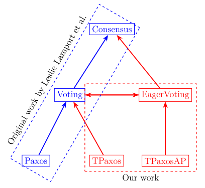

# Tencent-Paxos-TLA+

A project of using TLA+ to model the consensus algorithm in the paper [PaxosStore@VLDB2017](http://www.vldb.org/pvldb/vol10/p1730-lin.pdf) and the open-source [Tencent/paxosstore](https://github.com/Tencent/paxosstore).

## Specification

TPaxos(the consensus algorithm above) is a variant of basic Paxos, and we uncover a crucial but sutble detail in TPaxos which is not fully clarified, called TPaxosAP. We establish refinement mapping from TPaxos to Voting and from TPaxosAP to EagerVoting(equivalent to Voting) to verify the correctness of TPaxos and TPaxosAP, Voting is a high-level spec in paper [Byzantizing Paxos by Refinement](http://lamport.azurewebsites.net/pubs/web-byzpaxos.pdf).

### TLA+ module

- [TPaxos.tla](https://github.com/Starydark/Tencent-Paxos-TLA/blob/master/TPaxos.tla): the specification of TPaxos.
- [TPaxosAP.tla](https://github.com/Starydark/Tencent-Paxos-TLA/blob/master/TPaxosAP.tla): the specification of the variant of TPaxos.
- [TPaxosWithVotes.tla](https://github.com/Starydark/Tencent-Paxos-TLA/blob/master/TPaxosWithVotes.tla): the refinement mapping of TPaxos refining Voting.
- [TPaxosAPWithVotes.tla](https://github.com/Starydark/Tencent-Paxos-TLA/blob/master/TPaxosAPWithVotes.tla): the refinement mapping of TPaxosAP refining EagerVoting.
- [EagerVoting.tla](https://github.com/Starydark/Tencent-Paxos-TLA/blob/master/EagerVoting.tla): a specification that is equivalent to Voting.  
- [Voting.tla](https://github.com/Starydark/Tencent-Paxos-TLA/blob/master/Voting.tla): a specification introduced by Lamport in paper [Byzantizing Paxos by Refinement](http://lamport.azurewebsites.net/pubs/web-byzpaxos.pdf).
- [Consensus.tla](https://github.com/Starydark/Tencent-Paxos-TLA/blob/master/Consensus.tla): a specification that implemented by Voting.

### Refinement relation

## Model Checking

There are three experiments we have made:

- TPaxos and TPaxosAP satisfies Consistency.
- TPaxos refines Voting, TPaxosAP refines EagerVoting.
- EagerVoting refines Consensus.

### TLC Parameters

- Participant(Symmetry set): the set of all servers. e.g. {p1, p2, p3}
- Value(Symmetry Set): the set of all value. e.g. {v1, v2}
- Ballot(Redefine Nat): 0..2 or other bigger set

### Invariants and Properties

- Consistency (invariants)
- SpecV => V!Spec (Properties)

